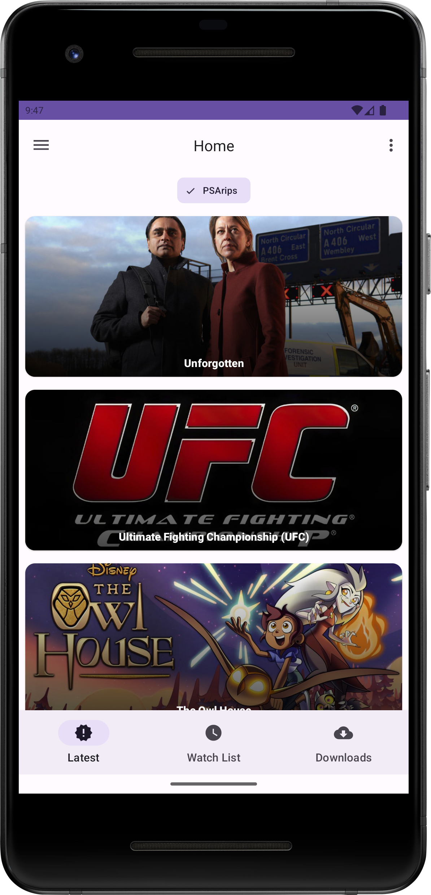
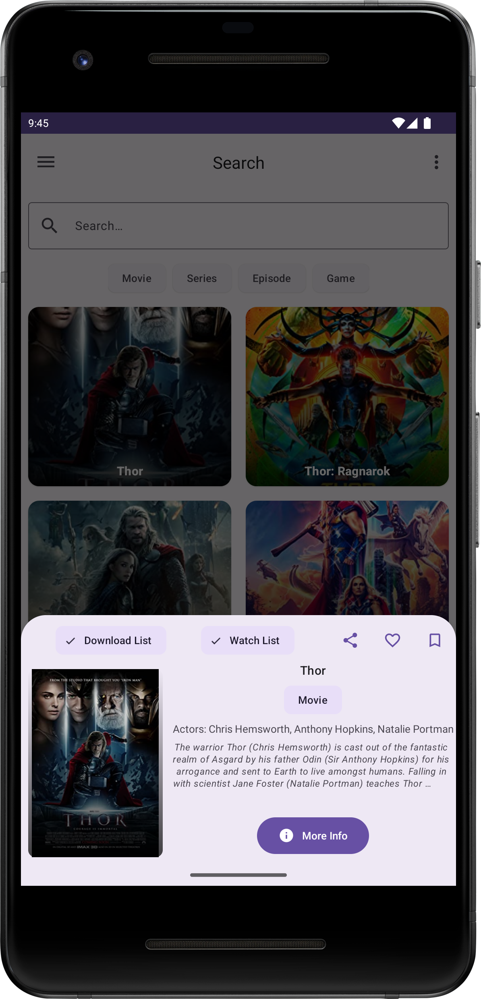
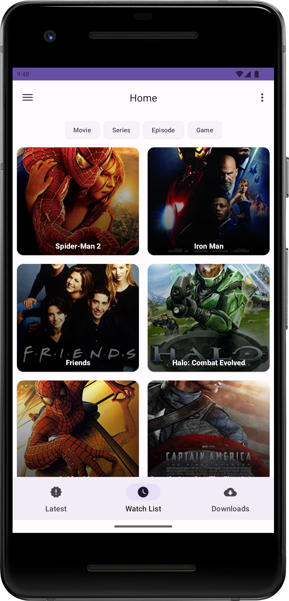

# Movie Application

This is a movie application

## Table of Contents
* [Features]().
* [Pre-requisites]().
* [Libraries Used]().
* [Contributions]().
* [Suggestions and criticism]().

## Features
* Displays the latest information from [PSArips](https://www.psarips.com).
* Search Movies, Series, Episode and Game names using OMBD api.
* Display attributes of the movie including Title, Actors and plot.
* Bookmark Movie, Add Movie to Favorites, Watch List and Download List.

## Pre-requisites
To build the project, you require an omdb api. Go to [their website](http://www.omdbapi.com/) and obtain one.
Add the api key to a file in src/main/res/values folder(you can add it to strings.xml)
```xml
    <string name="omdb_api_key"> </string>
```

You need a firebase project to host the realtime database. Add the  google-services.json to root of the app module.

## Libraries Used
* [Retrofit](https://square.github.io/retrofit/).
* [Glide](https://bumptech.github.io/glide/).
* Firebase:
  * [Firebase Database](https://firebase.google.com/products/realtime-database).
  * Firebase Analytics.

## Screenshots
<p align="center">

</p>

<p align="center">



</p>

## Contributions
Contributions are welcome in the project. To make a contribution, simply fork the repository and make a pull request.

## Suggestions and criticism
Suggestions are welcome, if you have a suggestion, create an issue. If you find a bug, open an issue.

